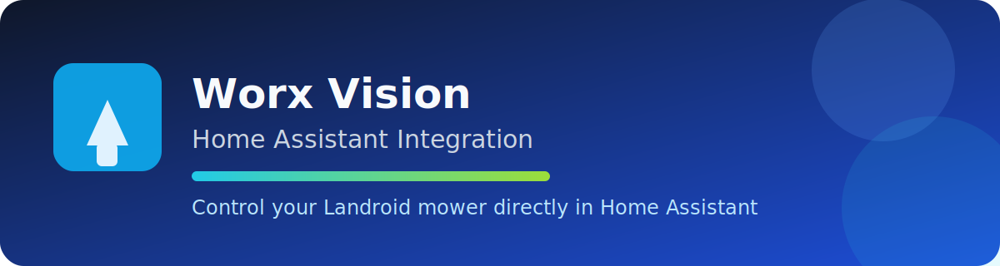

# Worx Vision for Home Assistant

Custom Home Assistant integration for Worx Vision / Landroid robotic mowers powered by `pyworxcloud`.

## Features

- Login with Worx account (email/password)
- Supports multiple mowers (select by serial number)
- Lawn mower control entity (start, pause, dock)
- Sensors for battery, state, errors, runtime, last update and GPS
- Binary sensors for mowing, rain delay, error and charging
- Schedule switch
- Additional services:
  - `worx_vision.start_zone`
  - `worx_vision.set_schedule`
  - `worx_vision.ots`

## Requirements

- Home Assistant `2024.3+`
- Worx/Landroid cloud account
- HACS (recommended)

## Installation

### HACS (recommended)

1. Open HACS and add this repository as a **Custom repository** (`Integration`).
2. Install **Worx Vision**.
3. Restart Home Assistant.
4. Go to **Settings → Devices & Services → Add Integration**.
5. Select **Worx Vision** and enter your credentials.

### Manual

1. Copy `custom_components/worx_vision` into your Home Assistant configuration directory.
2. Restart Home Assistant.
3. Add the integration via the UI.

## Configuration

- Enter Worx cloud email and password.
- If you have multiple mowers, choose the target mower.

## Services

| Service | Description | Fields |
|---|---|---|
| `worx_vision.start_zone` | Start mowing in a zone | `serial_number` (optional), `zone` (required) |
| `worx_vision.set_schedule` | Update mower schedule | `serial_number` (optional), `enabled` (optional), `time_extension` (optional), `entries` (optional) |
| `worx_vision.ots` | One-time schedule run | `serial_number` (optional), `boundary` (optional, default `false`), `runtime` (required, minutes) |

### Service field details

- `worx_vision.start_zone`
  - `serial_number` (optional)
  - `zone` (required)
- `worx_vision.set_schedule`
  - `serial_number` (optional)
  - `enabled` (optional)
  - `time_extension` (optional)
  - `entries` (optional list of schedule objects)
- `worx_vision.ots`
  - `serial_number` (optional)
  - `boundary` (optional, default `false`)
  - `runtime` (required, minutes)

## Support

- Issues / bug reports: <https://github.com/allroggen/landroid/issues>
- Feature requests are welcome via GitHub issues

## Hinweis (DE)

Diese Integration nutzt die inoffizielle Cloud-Kommunikation über `pyworxcloud`. Änderungen an der Hersteller-API können Funktionen beeinflussen.
